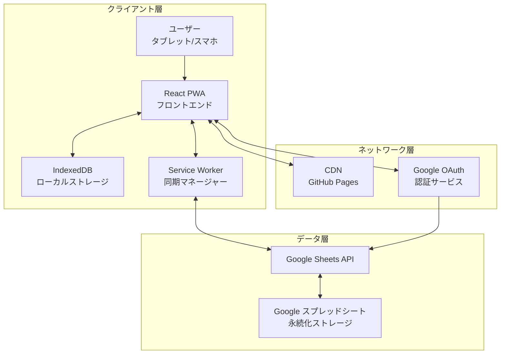
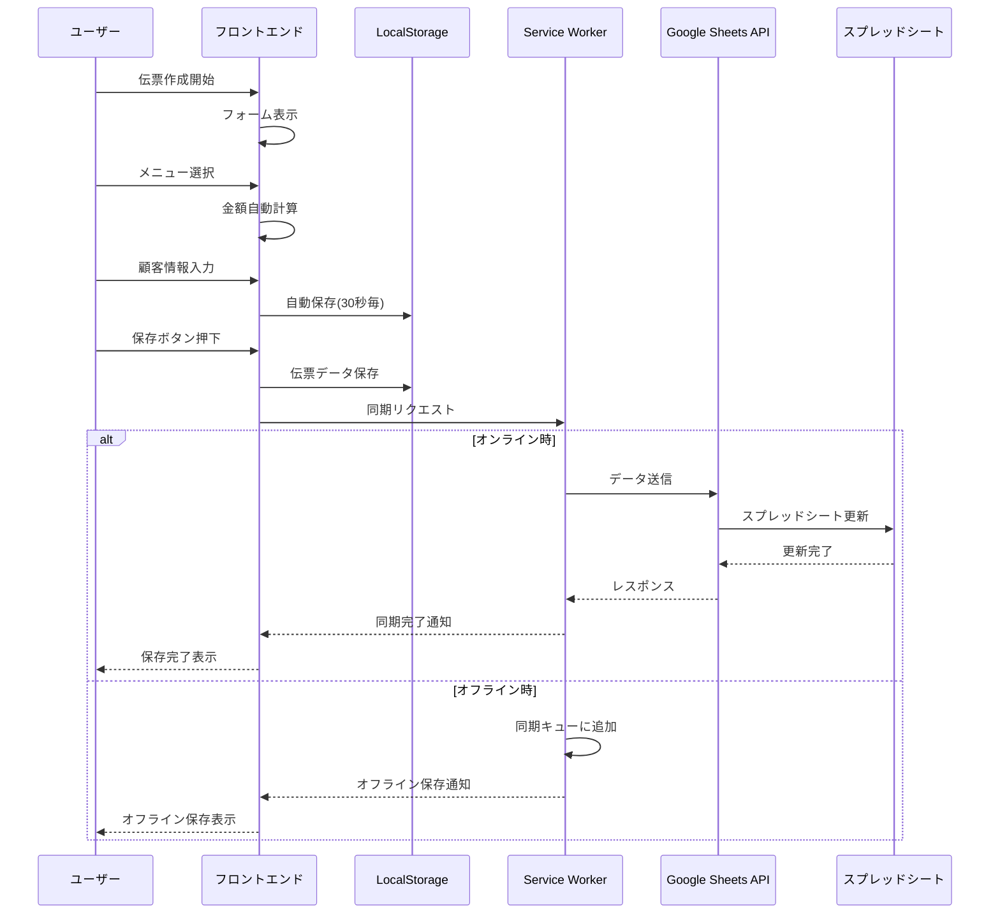
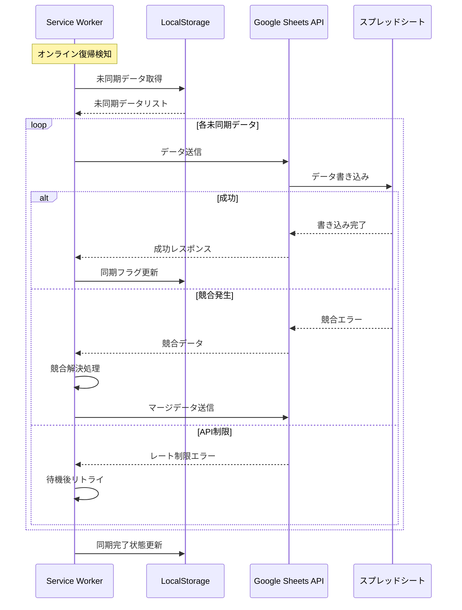
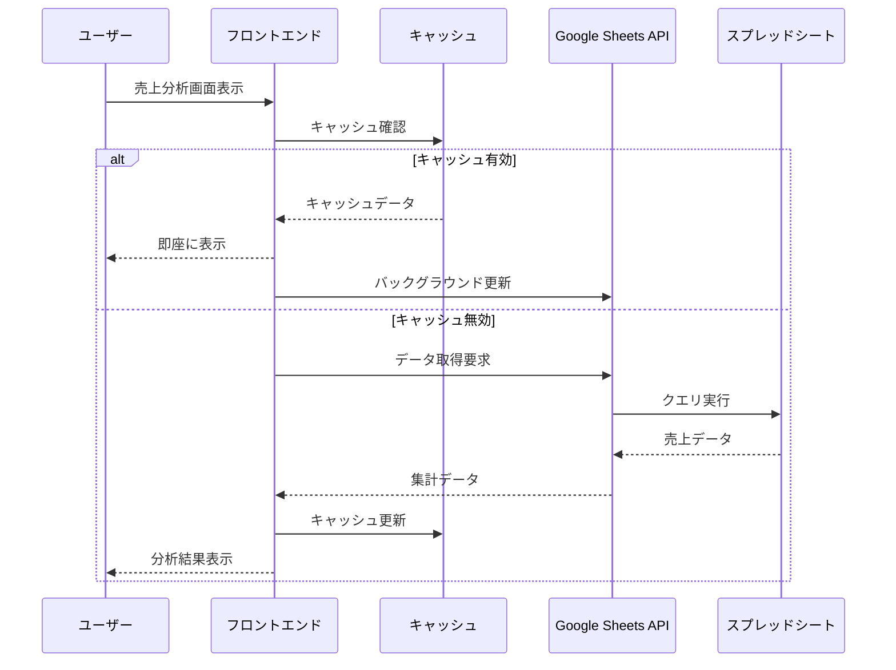
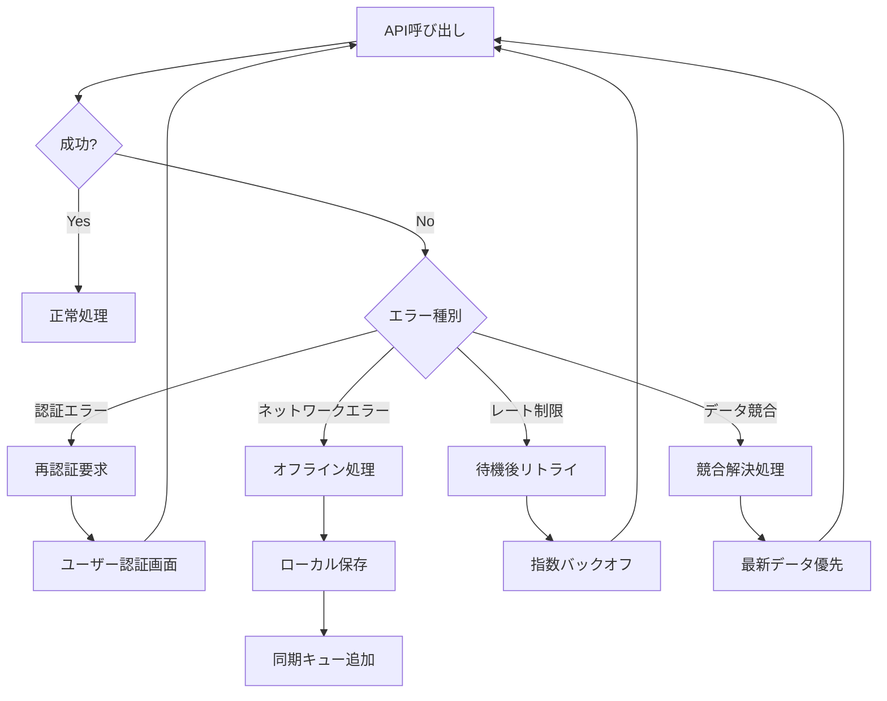

# データフロー図

## システム全体のデータフロー

## ユーザー操作フロー

### 1. 伝票作成フロー

### 2. データ同期フロー

### 3. 売上分析フロー

## エラーハンドリングフロー

## データフローの特徴

1. **オフラインファースト設計**
   - すべての操作はまずローカルで実行
   - バックグラウンドで非同期同期

2. **楽観的UI更新**
   - ユーザー操作は即座に反映
   - エラー時のみロールバック

3. **自動リトライメカニズム**
   - ネットワークエラー時の自動再試行
   - 指数バックオフによる負荷分散

4. **競合解決戦略**
   - タイムスタンプベースの解決
   - 最新データ優先原則
   - 変更履歴の保持